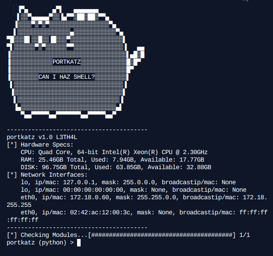

# PortKatz

PortKatz is a Toolkit designed for Exploitation, Post-Exploitation and Payload generation.



*PortKatz in action*

## Features

- Shows Hardware Specs on Startup

- CPU-Heat Aware and will stop on overheat (Hash-Cracking)

- Payload Generation

- Persistant Reverse Shells in multiple formats (C, Java, Python, PowerShell)

- Shellcode Injection Scripts

- Clipboard-Stealing

- Clipboard-Injection

- Pull Raw-Encrypted/UnEncrypted Passwords from Chrome (Windows)

- CPU-Heat Aware Multithreaded Hash Cracking for the most common hashes (MD5, SHA, NTLM, etc.)

- Cuteness

- Stealth-Mode for use on target systems

- Encode Shellcode/Payloads in multiple different formats

- File/Data Exfiltration

- Hide MSFVenom Payloads in Python Scripts using AV-Evasion Techniques

## Installation

### Git (All Modules Pre-Installed!)

Git Clone this repo, cd into the clone repo, install the dependencies and finally... Run PortKatz
```
$ git clone https://github.com/RaidTheWeb/portkatz.git
..snip..
$ cd portkatz
$ pip install -r requirements.txt
..snip..
$ python3 portkatz.py
```

### WGet (Single-File)

Grab the file and run it.

```
$ wget https://raw.githubusercontent.com/RaidTheWeb/portkatz/master/portkatz.py
..snip..
$ python3 portkatz.py
```

## License

GNU, GPL v3.0

```
PortKatz - Post-/Exploitation Toolkit.
Copyright (C) 2020  RaidTheWeb
This program is free software: you can redistribute it and/or modify
it under the terms of the GNU General Public License as published by
the Free Software Foundation, either version 3 of the License, or
(at your option) any later version.
This program is distributed in the hope that it will be useful,
but WITHOUT ANY WARRANTY; without even the implied warranty of
MERCHANTABILITY or FITNESS FOR A PARTICULAR PURPOSE.  See the
GNU General Public License for more details.
You should have received a copy of the GNU General Public License
along with this program.  If not, see <https://www.gnu.org/licenses/>.
```


## Example Of Use

Creating A Bare-Bones DNS-Based Reverse Shell


**NOTE:** The Examples Photos we're taken on a Shared Victim-Server. PortKatz Hardware Specifications *are* somewhat accurate.
